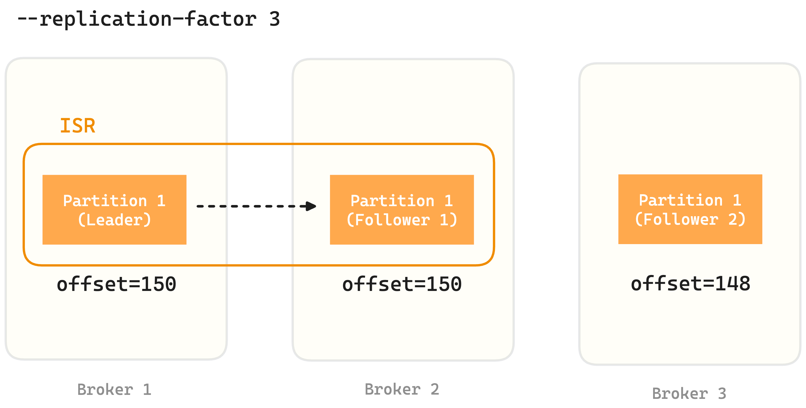

+++
author = "penguinit"
title = "Kafka ISR(In-Sync Replica)에 대해서 알아보기"
date = "2024-07-14"
description = "Kafka에서 복제본(Replication)에 대한 정책은 카프카 운영에 있어서 가용성과 성능에 있어서 큰 영향을 주는 설정이기 때문에 각 설정들이 어떤 것을 의미하는지 정확하게 이해하고 있어야합니다. 이를 정리하기 위한 포스팅을 합니다."
tags = [
"kafka", "isr"
]
categories = [
"infra"
]
+++

## 개요
Kafka에서 복제본(Replication)에 대한 정책은 카프카 운영에 있어서 가용성과 성능에 있어서 큰 영향을 주는 설정이기 때문에 각 설정들이 어떤 것을 의미하는지 정확하게 이해하고 있어야합니다. 이를 정리하기 위한 포스팅을 합니다.


## ISR(In Sync Replica) 이란?
카프카에서 복제본을 얘기할 때는 정확하게 는 파티션에 대한 브로커별로 생성되는 것을 의미합니다.

파티션에 대한 복제본은 리더와 팔로워로 나뉘어지고 ISR은 리더를 포함한 팔로워들이 동기화 되어있는 그룹들을 의미합니다.

리더는 새 메세지를 받으면 로컬에 로그를 쌓고 동시에 팔로워들에게 해당 메세지를 보내서 메세지를 동기화 합니다.



만약 리더가 판단 했을 때 특정 팔로워의 오프셋이 `replica.lag.time.max.ms` 설정 시간 안에 자신의 오프셋을 따라잡지 못하면 ISR에서 제외됩니다.

## ISR 관련 중요 설정 값

- min.insync.replicas: 쓰기 작업을 허용하기 위한 최소 ISR 수
- replica.lag.time.max.ms: 복제본이 ISR에서 제외되기 전의 최대 지연 시간
- unclean.leader.election.enable: ISR 외부의 복제본을 리더로 선출할지 여부 (기본값: true)

### 브로커 설정

```bash
# 최소 ISR 수 설정
min.insync.replicas=2

# 복제본이 ISR에서 제외되기 전의 최대 지연 시간 (밀리초)
replica.lag.time.max.ms=10000
```

### 토픽 생성 시 설정

```bash
bin/kafka-topics.sh --create --bootstrap-server localhost:9092 --topic my-topic --partitions 3 --replication-factor 3 --config min.insync.replicas=2
```

### ISR 설정확인

```bash
bin/kafka-topics.sh --create --bootstrap-server localhost:9092 --topic my-topic --partitions 3 --replication-factor 3 --config min.insync.replicas=2
```

## unclean.leader.election.enable

해당 값에 대한 기본 값은 카프카 버전에 따라서 다릅니다.

- Kafka 0.11.0.0 이전 버전: 기본값 true
- Kafka 0.11.0.0 ~ 현재까지 : 기본 값 false
  - 3.7.0이 현재 최신버전인데 아직까지 false로 유지
  - https://kafka.apache.org/documentation/#brokerconfigs_unclean.leader.election.enable

해당 값에 대한 의미는 브로커가 문제가 생겼을 때 해당 브로커에 파티션 리더가 있었다면 다른 브로커에 있는 파티션들 중에 하나는 리더 역할을 해야합니다. 

하지만 만약에 기존 팔로워들이 ISR 그룹에 없는 상태에서 리더가 되어버리면 데이터의 손실이 일어날 수 있습니다. 

이를 방지하기 위해서 ISR에 있는 파티션만 리더가 될 수 있게 하는 설정 값이 `unclean.leader.election.enable=false` 입니다. 이는 데이터의 손실이 없도록 보장해주지만 만약 유효한 ISR 그룹에 있는 팔로워 파티션들이 없다면 복구에 많은 시간이 걸릴 수 도 없습니다.


데이터의 손실보다 빠른 복구가 필요하다면 해당 값을 true로 하는게 더 좋을 수 있습니다.


## 정리
오늘 포스팅에서는 Kafka에서 ISR(In Sync Replica)에 대해서 알아보았습니다. ISR은 리더와 팔로워들이 동기화 되어있는 그룹을 의미하며 이를 통해서 데이터의 손실을 방지할 수 있습니다. 해당 내용이 도움이 되었으면 좋겠습니다.
