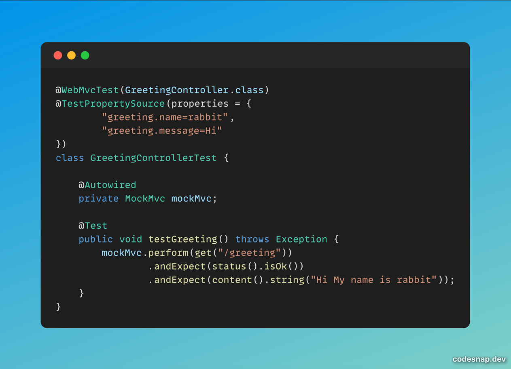
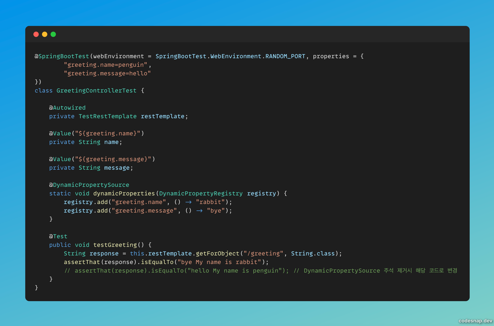

+++
author = "penguinit"
title = "스프링에서 설정 값을 다루는 방법과 우선순위 1편"
date = "2024-07-17"
description = "스프링에서는 설정 값을 다루는 방법이 다양합니다. 이번 포스팅에서는 스프링 부트에서 설정 값을 다루는 방법과 설정 값의 우선순위에 대해 알아보겠습니다."
tags = [
"spring-boot", "config"
]
categories = [
"language"
]
+++

## 개요
스프링에서는 설정 값을 다루는 방법이 다양합니다. 이번 포스팅에서는 스프링 부트에서 설정 값을 다루는 방법과 설정 값의 우선순위에 대해 알아보겠습니다.

## 스프링에서 설정 값
스프링 공식 문서에 따르면 스프링에서 설정 값을 다루는 방법은 다음과 같습니다. [참조](https://docs.spring.io/spring-boot/reference/features/external-config.html)

환경변수 우선순위 설정 (`번호가 높을 수록 우선순위가 높습니다`)

1. Default properties (specified by setting SpringApplication.setDefaultProperties).

2. @PropertySource annotations on your @Configuration classes. Please note that such property sources are not added to the Environment until the application context is being refreshed. This is too late to configure certain properties such as logging.* and spring.main.* which are read before refresh begins.

3. Config data (such as application.properties files).

4. A RandomValuePropertySource that has properties only in random.*.

5. OS environment variables.

6. Java System properties (System.getProperties()).

7. JNDI attributes from java:comp/env.

8. ServletContext init parameters.

9. ServletConfig init parameters.

10. Properties from SPRING_APPLICATION_JSON (inline JSON embedded in an environment variable or system property).

11. Command line arguments.

12. properties attribute on your tests. Available on @SpringBootTest and the test annotations for testing a particular slice of your application.

13. @DynamicPropertySource annotations in your tests.

14. @TestPropertySource annotations on your tests.

15. Devtools global settings properties in the $HOME/.config/spring-boot directory when devtools is active.

### (15번) Devtools 전역 설정 속성

[참조](https://docs.spring.io/spring-boot/reference/using/devtools.html#using.devtools.globalsettings)

어떤 형태의 설정 값 보다 우선되고 아래 처럼 `spring-boot-devtools.properties` 파일을 생성하면 runtime에 해당 파일을 참조합니다.

```groovy
dependencies {
    runtimeOnly 'org.springframework.boot:spring-boot-devtools' // 추가
}
```

`$HOME/.config/spring-boot/spring-boot-devtools.properties` 생성

```yaml
greeting.name=rabbit
```

### (14번) TestPropertySource 애노테이션

테스트를 위해서 사용되는 설정 값 입니다. 아래 처럼 설정 할 수 있습니다. (컨트롤러 테스트)



### (12번,13번) Spring Boot Test 속성, DynamicPropertySource 애노테이션

Spring Boot Test 어노테이션에서의 설정값 정의는 DynamicPropertySource 어노테이션에서의 정의보다 우선 순위가 떨어집니다.

아래의 결과 값은 DynamicPropertySource에서 정의한 “bye My name is rabbit” 이 더 우선하게 됩니다.



### (11번) 명령어에 인수로 전달

CLI로 실행시 인수로 전달할수도 있습니다. 해당 부분은 15번 devtools를 제외하고는 메인함수에서는 가장 우선되기 때문에 아래처럼 명렁어를 수행하면 결과 값이 다르게 적용되는 것을 확인할 수 있습니다.

```bash
java -jar build/libs/configuration-0.0.1-SNAPSHOT.jar --greeting.name=jinyong
```

### (10번) SPRING_APPLICATION_JSON을 통한 설정

spring boot 실행시 SPRING_APPLICATION_JSON 값을 설정하고 읽어서 적용할 수 있습니다.

인수로 전달하는 것보다는 우선순위는 떨어지지만 json으로 전달하기에 복잡한 구조도 좀 더 편하게 접근할 수 있는 장점이 있습니다.

```bash
java -Dspring.application.json='{"greeting.name":"json"}' -jar build/libs/configuration-0.0.1-SNAPSHOT.jar
```

### (8번, 9번) Servlet을 통한 설정

서블릿(Servlet)은 Java EE 사양의 일부로, 웹 애플리케이션의 HTTP 요청과 응답을 처리하기 위한 표준 인터페이스입니다.

스프링도 결국이는 해당 서블릿(Servlet)을 이용해서 만들어진 고차원 프레임워크라고 할 수 있습니다.

해당부분 모두 init 함수의 ServletConfig, ServletContext를 통해서 설정할 수 있지만 스프링을 사용하면서 서블릿을 직접 작성할 일은 거의 전무하기 때문에 따로 예제를 작성하지 않았습니다.

## 정리
해당 포스팅에서는 스프링 부트에서 설정 값을 다루는 방법에는 어떤 것들이 있는지를 소개하고 우선 순위와 예제를 통해서 15번에서 8번까지의 설정 값을 다루는 방법을 알아보았습니다. 다음 포스팅에서는 7번부터 1번까지의 설정 값을 다루는 방법을 알아보겠습니다.