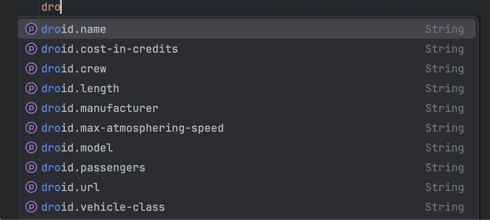
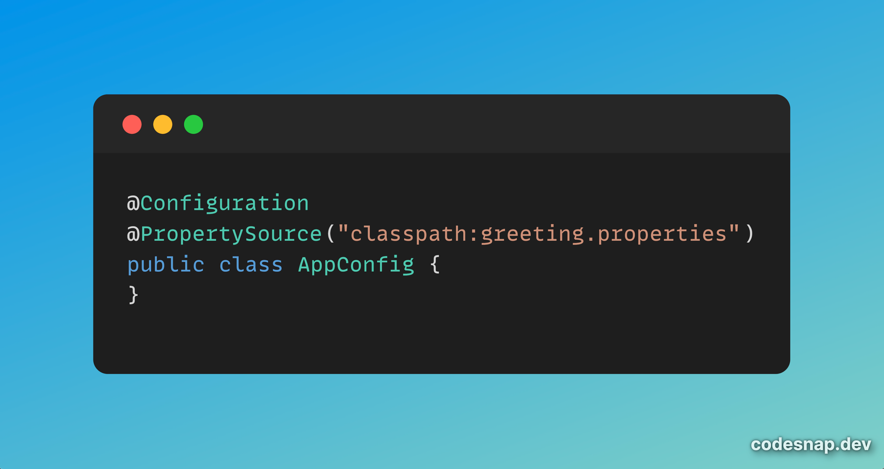
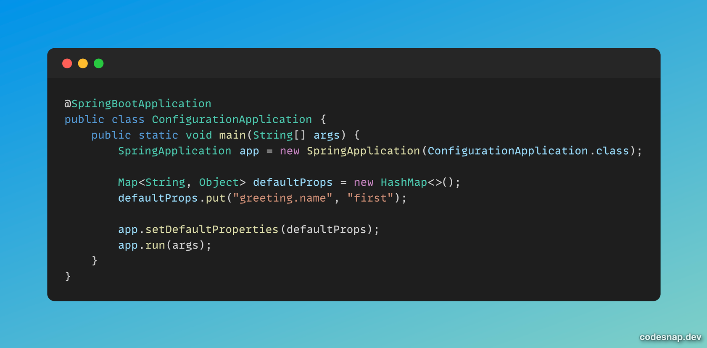

+++
author = "penguinit"
title = "스프링에서 설정 값을 다루는 방법과 우선순위 2편"
date = "2024-07-17 12:00:00"
description = "이전 포스팅에서는 스프링 문서에서 알려주는 설정 값의 우선순위에 대해 15번에서 8번까지 알아보았습니다. 이번 포스팅에서는 설정 값을 어떻게 참조하는지와 나머지 7번에서 1번까지 알아보겠습니다."
tags = [
"spring-boot", "config"
]
categories = [
"language"
]
+++

## 개요
이전 포스팅에서는 스프링 문서에서 알려주는 설정 값의 우선순위에 대해 15번에서 8번까지 알아보았습니다. 이번 포스팅에서는 설정 값을 어떻게 참조하는지와 나머지 7번에서 1번까지 알아보겠습니다.

## 스프링에서 설정 값 참조하기
스프링에서는 @Value 어노테이션과 @ConfigurationProperties 어노테이션을 사용하여 설정 값을 참조할 수 있습니다. 

### @Value 어노테이션
@Value 어노테이션은 설정값을 참조하는 가장 간편한 방법으로 아래 처럼 사용됩니다.

- application.properties

```yaml
greeting.name=Penguin
greeting.message=Hello, ${greeting.name}!
```

- GreetingController.java

```java
@RestController
public class GreetingController {
    @Value("${greeting.name: unknown}")
    private String name;

    @Value("${greeting.message: unknown}")
    private String message;

    @RequestMapping("/greeting")
    public String greeting() {
        return message + " My name is " + name;
    }
}
```

${name: default} 형태로 만약에 설정 값이 없을 때 디폴트 값을 설정할 수 있고 설정값은 다른 설정값의 속성으로 파생하거나 설정할 수 있습니다.

하지만 아래 처럼 참조되는 값을 주석처리하게 되면 에러가 발생하게 됩니다.

```yaml
# greeting.name=Penguin
greeting.message=Hello, ${greeting.name}!
```

또 IDE에서 자동완성을 지원하지 않아서 사람이 입력할 때 실수를 유발할 수도 있습니다.

### @ConfigurationProperties 어노테이션

@Value가 유연하지만 단점이 있기 때문에 이후 스프링 개발팀에서 @ConfigurationProperties를 만들었습니다.

ConfigurationProperties를 사용하기 위해서는 아래 두개를 미리 설정해둬야 합니다.

#### 사전작업

- annotationProcessor 'org.springframework.boot:spring-boot-configuration-processor' 의존성 추가
- SpringBootApplication 어노테이션쪽에 ConfigurationPropertiesScan 어노테이션 추가

ConfigurationProperties 어노테이션을 통한 설정값 적용은 직접 Class에 선언하거나 Bean 등록을 통해서 간접적으로 의존성을 주입할 수 있습니다.

1. Class에 선언

```java
@Data
@AllArgsConstructor
@NoArgsConstructor
@ConfigurationProperties(prefix = "greeting")
public class GreetingDto {
    private String name;
    private String message;
}
```

2. Bean으로 선언

```java
@Bean
@ConfigurationProperties(prefix = "droid")
public DroidDto droidDto() {
    return new DroidDto();
}
```

ConfigurationProperties를 선언할 때 prefix를 통해서 자동완성을 IDE에서 지원받을 수 있습니다.




### 스프링에서 설정 값
[이전 포스팅]((/post/202407/7/))에서 다루었던 우선순위 값 이후 7번에서 1번까지 설정 값을 다루는 방법을 알아보겠습니다.

### (7번) JNDI(Java Naming and Directory Interface)

JNDI는 객체와 이름을 매핑할 수 있는 네이밍 서비스를 제공합니다. 이를 통해 클라이언트는 특정 이름을 통해 원하는 객체에 접근할 수 있습니다.

보통 많이 사용하는 경우로는 Tomcat META-INF/context.xml에 DB 관련 정보를 넣어두고 앱에서는 단순하기 JNDI 네임을 통해서 해당 객체를 참조만 하는 형태로 작성합니다.

이렇게 작성하게 되면 개발하는 입장에서는 환경별로 하드코딩이 필요없고 JNDI 객체만 잘 입력하기 때문에 깔끔하게 작성할 수 있습니다.

### (6번) Java System Properties

SPRING_APPLICATION_JSON과 유사하게 명령줄에서 Java 시스템 속성을 설정할 수 있습니다.

-D 옵션은 시스템 속성을 정의 합니다.

**-D <property name>=<property value>**

```bash
java -Dgreeting.name='jinyong' -jar build/libs/configuration-0.0.1-SNAPSHOT.jar
```

### (5번) 환경변수

환경변수를 설정하면 해당 값을 읽을 수 있습니다. (네이밍 스타일 변경주의)

```bash
GREETING_NAME=jinyong java -jar build/libs/configuration-0.0.1-SNAPSHOT.jar
```

### (4번) RandomValuePropertySource

설정값에 random.(*) 형태로 작성하게 되면 무작위 값이 붙게 됩니다. 만약 application.properties에서 해당 패턴으로 값을 정의하게 되면 무시하고 랜덤한 값이 출력됩니다.

### (3번) application.properties

별도의 설정없이도 spring boot에서는 resource 하위에 정의된 application.properties를 읽습니다.

### (2번) PropertySource 어노테이션

특정 파일을 명시해서 설정값으로 읽을 수 있습니다. 아래처럼 greeting.properties를 읽어 들이는 AppConfig Bean을 등록합니다.



우선순위는 config data보다 낮기 때문에 동일한 이름을 가지고 있다면 application.properties가 더 우선순위를 가지게 됩니다.

### (1번) SpringApplication default Props 활용

SpirngApplication 객체의 setDefaultProperties를 활용해서 설정 값을 실행시 넣을 수 있습니다.

가장 낮은 우선순위를 가지고 실제로 중복되는 이름으로 실행 했을 때 값이 덮어쓰기 되는 것을 확인할 수 있습니다.



## 정리
스프링에서 설정 값을 다루는 방법과 우선순위에 대해 알아보았습니다. 설정 값의 우선순위는 15번에서 1번까지 순서대로 높아지며, 같은 이름의 설정 값이 있을 경우 높은 우선순위의 설정 값이 적용됩니다. 

현업에서 이렇게 중복해서 사용할 일은 많지는 않다고 생각하지만 설정 값의 우선순위를 알고 있으면 문제가 발생했을 때 좀 더 빠르게 해결할 수 있을 것이라고 생각합니다. 해당 포스팅이 도움이 되었으면 합니다. 
