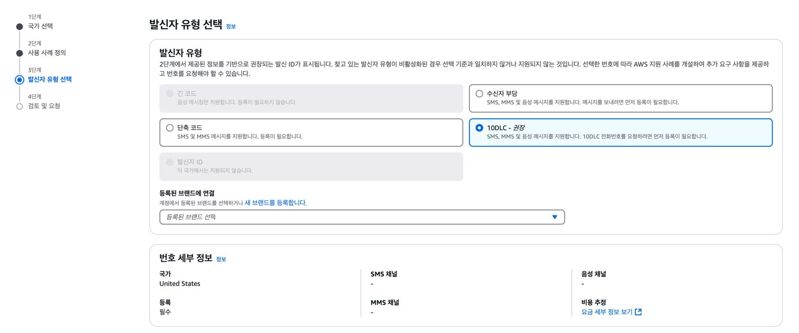

+++
author = "penguinit"
title = "AWS에서 EUM(End User Messaging)을 사용할 때 주의할 점"
date = "2024-12-26"
description = "AWS에서 EUM(End User Messaging)을 사용할 때 다른 나라에서 발생할 수 있는 문제점과 해결 방법에 대해 알아보겠습니다."
tags = [
"aws", "eum"
]
categories = [
"infra"
]
+++

## 개요
AWS에서 EUM(End User Messaging)을 사용할 때 다른 나라에서 발생할 수 있는 문제점과 해결 방법에 대해 알아보겠습니다.

## 문제점
AWS에서 직접 문자 메세지를 보내는 경우, 한국에서는 잘 동작하지만 다른 나라에서는 동작하지 않을 수 있습니다. 

이전에 개발했던 서비스는 글로벌하게 서비스를 제공하고 있었는데(대부분은 미국 유저들이 많았음), 한국에서는 문자 메세지가 잘 도착했지만 다른 나라에서는 문자 메세지가 도착하지 않는 문제가 발생했었습니다. 

## 10DLC
10DLC(10 Digit Long Code)는 미국에서 사용되는 10자리 전화번호로, 미국에서는 이 번호를 사용하여 문자 메세지를 보내야 합니다. 만약에 10DLC를 사용하지 않으면, 위에서 언급한 것 처럼 문자 메세지가 도착하지 않을 수 있습니다.

### 관리주체
- The Campaign Registry(TCR)라는 중앙 등록 기관에서 관리
- 주요 미국 이동통신사들(AT&T, T-Mobile, Verizon 등)이 공동으로 관리
- 미국 이동통신사들은 10DLC를 사용하지 않는 메세지를 차단할 수 있음

### 등록방법
10DLC를 등록하고 운영하는데는 생각보다 많은 절차가 필요합니다. 우선 The Campaign Registry(TCR)에 등록을 해야하고, 등록을 하기 위해서는 다음과 같은 사전 절차가 필요합니다.

1. 브랜드 등록
2. 브랜드 승인 대기 (CREATED 상태는 아직 완전히 승인된 것이 아님)
3. 브랜드가 완전히 승인된 후 캠페인 등록 가능

브랜드 등록은 보통 1-2주 정도 소요될 수 있고 승인이 완료되면 상태가 'VERIFIED'로 변경됩니다. 아래 첨부한 임의로 등록한 브랜드 입니다.

만약에 브랜드가 승인이되면 캠페인을 등록할 수 있습니다. 캠페인 등록은 브랜드 등록과 비슷한 절차를 거치며, 캠페인 등록이 완료되면 상태가 'APPROVED'로 변경됩니다.

실제로 브랜드 등록이 되지 않은 상태이지만 위에 언급했듯이 브랜드 등록이 완료되면 캠페인 등록이 가능합니다.

만약 캠페인까지 등록이 완료되면, 발신자 등록을 통해서 10DLC를 연결할 수 있습니다. (첨부된 이미지는 실제로 등록하진 않았고 단계를 보여주기 위한 것입니다.)

## 결론
사실 개인적으로는 만약에 이렇게 번거롭게 10DLC를 등록해야 한다면, AWS에서 제공하는 EUM을 사용하는 것이 아닌 다른 서비스를 사용하는 것이 더 효율적일 것 같습니다. 하지만, 만약에 AWS에서 EUM을 사용해야 한다면, 10DLC 등록 절차를 미리 숙지하고 진행하는 것이 좋을 것 같습니다.